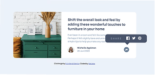

# Frontend Mentor - Article preview component solution

This is a solution to the [Article preview component challenge on Frontend Mentor](https://www.frontendmentor.io/challenges/article-preview-component-dYBN_pYFT).

## Table of contents

- [Overview](#overview)
  - [The challenge](#the-challenge)
  - [Screenshot](#screenshot)
  - [Links](#links)
- [My process](#my-process)
  - [Built with](#built-with)
  - [What I learned](#what-i-learned)
  - [Useful resources](#useful-resources)
- [Author](#author)

## Overview

### The challenge

To build responsive article preview component with posibility to see the social media share links.

### Screenshot



### Links

- Solution URL: [repository](https://github.com/samulikn/article)
- Live Site URL: [live site](https://samulikn.github.io/article)

## My process

### Built with

- Semantic HTML5
- [Sass](https://sass-lang.com) - preprocessor for CSS
- CSS Flexbox
- Vanilla JavaScript

### What I learned

Improve my knowledge to work with pictures and applying filters on it.

The element is first turned black. Then the colors are inverted → black becomes white.

```css
.shareicon-active {
  filter: brightness(0) invert(1);
  ...
}
```

### Useful resources

- [Guide to Flexbox](https://www.joshwcomeau.com/css/interactive-guide-to-flexbox/) - Helpful interactive guide to Flexbox.

## Author

- Website - [Nataliia](https://natashobotova.onrender.com)
- Frontend Mentor - [@samulikn](https://www.frontendmentor.io/profile/samulikn)
